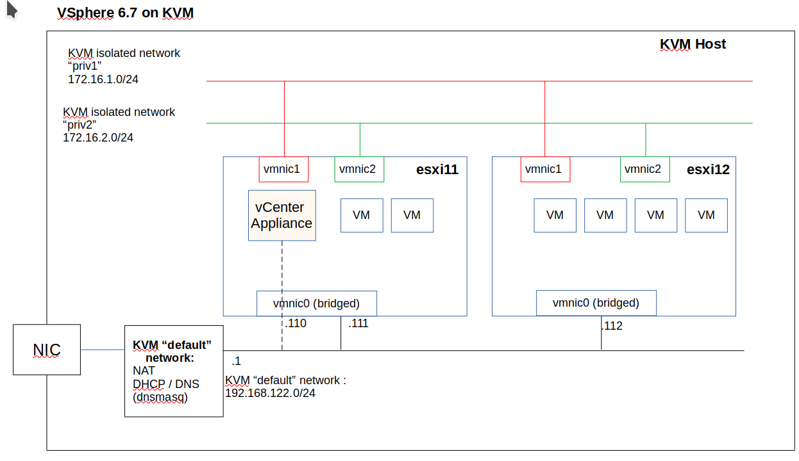

# vmware-vsphere6.7-on-kvm-lab
Home lab nested installation of vSphere 6.7 on KVM

This document describes the deployment of a basic vSphere  6.7 lab hosted in a nested  Linux KVM environment.

A similar lab using vSphere 7.0 is documented in a [separate github repository](https://github.com/rpgd60/vmware-vsphere7-on-kvm-lab).    

- NOTE: Initial experience shows that the 6.7 lab works better than the 7.0 lab due to the simpler vCenter installation and lower level of RAM/Disk/CPU requirements of the former.

The diagram below summarizes the deployment

**Motivation**:  Deploying a vSphere nested environment in KVM is admittedly not very practical.   Most people would recommend using ESXi as the base hypervisor for these experiments.   

In my case, I need to learn VMware, but I do not wish to have a dedicated home lab environment with servers, storage, etc.   I use instead  a 15" laptop (see specs below) running Kubuntu  that doubles as  second home computer and media server.  I do most of my cloud and virtualization work and testing either in cloud providers or in this laptop using KVM.

**Disclaimer**: The usual caveats apply:  This describes a lab built on virtual hardwere non-supported by VMware and should not be deployed or tested in any production environment.   You should backup your systems before deploying this and similar labs, etc., etc. 

The actual document is written in markdown using Typora.  The figures are in the ".assets" subdirectory.
