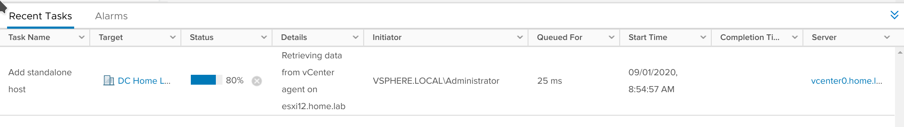

# vSphere 7 - Nested Lab on Linux / KVM


## Introduction and Motivation

This document describes the deployment of a basic vSphere  7  lab hosted in a nested  Linux KVM environment.

The diagram below summarizes the deployment


 **Motivation**:  Deploying a vSphere nested environment in KVM is admittedly not very practical.   Most people would recommend using ESXi as the base hypervisor for these experiments.   

In my case, I do not wish to have a dedicated home lab environment with servers, storage, etc.   I use instead  a 15" laptop running Kubuntu  that doubles as  second home computer and media server.  I do most of my cloud and virtualization work and testing either in cloud providers or in this laptop using KVM.

**Disclaimer**: The usual caveats apply:  This is a lab built on non-supported virtual hardware and should not be deployed or tested in any production environment.   You should backup  your systems before deploying this and similar labs, etc. 


## References 

This document is partially based on the excellent blog entries by Fabian Lee on [ESXi on KVM](https://fabianlee.org/2018/09/19/kvm-deploying-a-nested-version-of-vmware-esxi-6-7-inside-kvm/),  and [vCenter on KVM](https://fabianlee.org/2018/11/06/kvm-deploy-the-vmware-vcenter-appliance-using-the-cli-installer/) for vSphere 6.7

The main differences  and additions to those sources from this experiment :

- For the VMs definitions for ESXi host applied some of the same parameters used for vSphere 7.0
  - Requires modifying the NIC  to use "vmxnet3" (e1000 no longer supported in KVM 7)
- vCenter Installation
  - Mount appliance iso and run installer in KVM host  (instead of dedicated VM)
  - Use GUI instead of cli installer for vCenter Appliance
- vCPU - I used "--cpu host" instead of "--cpu host-model-only".   Without this change,  VMs inside ESXi hosts refused to start.
- Networking:
  - Use additional KVM "isolated networks" (additional NICs in the ESXi hosts) in addition to the KVM default network 
- Storage :  (TODO) explore FreeNAS for iSCSI and/or NFS storage in addition to local disks.
- Others:  Use VMware Photon VMs (OVF) for testing instead of net

### Experience

- TBC

### Host - Kubuntu

Hypervisor / KVM Host:  15" laptop ([Slimbook PRO Base 15 i7](https://slimbook.es/en/)) with 8 CPUs, 32GB RAM and 2 x 1TB SSD hard disks (one of them NVMe) 

OS - Kubuntu 20.04 

Below is a subset of the /proc/cpuinfo for the first cpu

```bash
$ cat /proc/cpuinfo
processor       : 0
vendor_id       : GenuineIntel
cpu family      : 6
model           : 142
model name      : Intel(R) Core(TM) i7-10510U CPU @ 1.80GHz
stepping        : 12
microcode       : 0xd6
cpu MHz         : 2245.567
cache size      : 8192 KB
physical id     : 0
siblings        : 8
core id         : 0
cpu cores       : 4
apicid          : 0
initial apicid  : 0
fpu             : yes
fpu_exception   : yes
cpuid level     : 22
wp              : yes
flags           : fpu vme de pse tsc msr pae mce cx8 apic sep mtrr pge mca cmov pat pse36 clflush dts acpi mmx fxsr sse sse2 ss ht tm pbe syscall nx pdpe1gb rdtscp lm constant_tsc art arch_perfmon pebs bts rep_good nopl xtopology nonstop_tsc cpuid aperfmperf pni pclmulqdq dtes64 monitor ds_cpl vmx est tm2 ssse3 sdbg fma cx16 xtpr pdcm pcid sse4_1 sse4_2 x2apic movbe popcnt tsc_deadline_timer aes xsave avx f16c rdrand lahf_lm abm 3dnowprefetch cpuid_fault epb invpcid_single ssbd ibrs ibpb stibp ibrs_enhanced tpr_shadow vnmi flexpriority ept vpid ept_ad fsgsbase tsc_adjust bmi1 avx2 smep bmi2 erms invpcid mpx rdseed adx smap clflushopt intel_pt xsaveopt xsavec xgetbv1 xsaves dtherm ida arat pln pts hwp hwp_notify hwp_act_window hwp_epp md_clear flush_l1d arch_capabilities
bugs            : spectre_v1 spectre_v2 spec_store_bypass swapgs itlb_multihit srbds
bogomips        : 4599.93
clflush size    : 64
cache_alignment : 64
address sizes   : 39 bits physical, 48 bits virtual
power management:
```

Here is some unsolicited advertising plugin for the Slimbook brand of linux-oriented laptops from the famed [dedoimedo website](https://www.dedoimedo.com/computers/slimbook-pro2-here.html)

## Hypervisor - KVM

### KVM Installation and verification

 - The following [companion article](https://fabianlee.org/2018/08/27/kvm-bare-metal-virtualization-on-ubuntu-with-kvm/) to the vSphere-on-KVM references mentioned above provides a good introduction to the installation of KVM.
 - Versions used for Kubuntu, KVM and virsh/libvirtdThe installation process

```
$ cat /etc/os-release 
NAME="Ubuntu"
VERSION="20.04.1 LTS (Focal Fossa)"
ID=ubuntu
ID_LIKE=debian
PRETTY_NAME="Ubuntu 20.04.1 LTS"
VERSION_ID="20.04"

$ uname -a
Linux rpslim 5.4.0-42-generic #46-Ubuntu SMP Fri Jul 10 00:24:02 UTC 2020 x86_64 x86_64 x86_64 GNU/Linux

$ kvm --version
QEMU emulator version 4.2.0 (Debian 1:4.2-3ubuntu6.3)
Copyright (c) 2003-2019 Fabrice Bellard and the QEMU Project developers

$ virsh version
Compiled against library: libvirt 6.0.0
Using library: libvirt 6.0.0
Using API: QEMU 6.0.0
Running hypervisor: QEMU 4.2.0

```


### KVM networking

 - All VMs (ESXi hosts) have their main NIC linked to the  *default*  libivrt network,  associated to the usual subnet 192.168.122.0/24 
 - DNS and DHCP (if using dynamic addresses) are handled by the dnsmasq instance associated with the *default* network of KVM.    We do not modify directly the dnsmasq configuration files.  Instead the configuration is done through libvirt ,  either using "virsh" commands or updating the *default* network XML configuration file. 

#### IP assignment for ESXi and vCenter VMs / DHCP vs Static

- The ESXi and vCenter VMs will have static addresses in their main interfaces, that are associated to the  KVM default network
- Looking at the DHCP  section in the  *default* network configuration XML file (see DNS section, pasted below for convenience) we see that the range for dynamic addresses is from 192.168.122.10 - .99.  Thus we chose the static addresses for the ESXi and vCenter addresses outside of this range.

```
  <ip address='192.168.122.1' netmask='255.255.255.0'>
    <dhcp>
      <range start='192.168.122.10' end='192.168.122.99'/>
    </dhcp>
  </ip>
```

  

#### DNS for VMs

- It is important for the ESXi and vCenter installation that all hosts have DNS entries.
- The VMs will have configured as DNS server : 192.168.122.1.  This is the dnsmasq DNS/DHCP server associated with the default network.
- This server can be configured using the command ```virsh net-edit default```  that starts an editor to modify the default network XML configuration file.   Add the lines between ```<dns>``` and ```</dns>```.  In this example we have added 3 entries,  one for each ESXi host (esxi11 and esxi12) and one for the vCenter VM running in esxi11.  
- We use vcenter0.home.lab for vCenter 6.7  since the fqdn vcenter.home.lab is used for vSphere 7.0 lab

```xml
<network>
  <name>default</name>
  <uuid>cedc08b7-e83d-48ae-9806-3b4de0481c7f</uuid>
  <forward mode='nat'/>
  <bridge name='virbr0' stp='on' delay='0'/>
  <mac address='52:54:00:62:d4:02'/>
  <domain name='home.lab'/>
  <dns>
    <host ip='192.168.122.110'>
      <hostname>vcenter0.home.lab</hostname>
    </host>
    <host ip='192.168.122.111'>
      <hostname>esxi11.home.lab</hostname>
    </host>    <host ip='192.168.122.112'>
      <hostname>esxi12.home.lab</hostname>
    </host>
    <host ip='192.168.122.123'>
      <hostname>esxi23.home.lab</hostname>
    </host>

  </dns>
  <ip address='192.168.122.1' netmask='255.255.255.0'>
    <dhcp>
      <range start='192.168.122.10' end='192.168.122.99'/>
    </dhcp>
  </ip>
</network>

```

- After modifying this file,  restart the *default* network with the command 

  ```bash
  $ virsh net-destroy default && virsh net-start default
  ```

  If connectivity to VMs is lost after restarting the *default* network, an option is to restart the libvirtd service

  ```
  $ sudo systemctl restart libvirtd.service
  ```

  NOTE: according to the libvirtd man entry  it is safe to restart libvirtd for running VMs with a persistent configuration:

  *Restarting libvirtd does not impact running guests.  Guests continue to operate and will be picked up automatically if their XML configuration has been defined.  Any guests whose XML configuration has not been defined will be lost from the configuration.*

  ("defined" above refers to the *virsh define* (persistent) as opposed to the *virsh create* (non-persistent) command)

- An alternative to editing the network definition XML file is to use the 'virsh net-update' command, issuing one command per host:

  ``` 
  $ virsh net-update default add dns-host  "<host ip='192.168.122.110'><hostname>vcenter0.home.lab</hostname></host>" --config --live
  
  $ virsh net-update default add dns-host  "<host ip='192.168.122.111'><hostname>esxi11.home.lab</hostname></host>" --config --live
  
  $ virsh net-update default add dns-host  "<host ip='192.168.122.112'><hostname>esxi12.home.lab</hostname></host>" --config --live
  
  ```

  

#### DNS / Name resolution at host Level

- **NOTE** - this  hypervisor does not use a host-level instance of dnsmasq or other DNS server.   Per ubuntu default installations, at host level it uses the recent (and somewhat controversial)  *systemctl resolved* resolver.  

- In practice we chose to add the same hosts to the host-level /etc/hosts file to make sure they are visible from the host (e.g. to use vSphere client, etc...)

  ```
  $ cat /etc/hosts
  (...)
  # vSphere 7.0 lab
  192.168.122.120 vcenter vcenter.home.lab
  192.168.122.121 esxi21 esxi21.home.lab
  192.168.122.122 esxi22 esxi22.home.lab
  # vSphere 6.7 lab
  192.168.122.110 vcenter0 vcenter0.home.lab
  192.168.122.111 esxi11 esxi21.home.lab
  192.168.122.112 esxi12 esxi12.home.lab
  192.168.122.113 esxi13 esxi13.home.lab
  
  
  (...)
  ```

- Some people choose to disable systemd-resolved and use instead a host-level instance of dnsmasq.  In this case it is needed to make it coexist with the KVM network level instance of dnsmask.   See for example https://www.ctrl.blog/entry/resolvconf-tutorial.html

  #### Connectivity to Outside world

  - All VMs have as default route  192.168.122.1 in the *default* KVM network.
  - The *default* network is configured by default to use NAT to the outside world.

  #### NTP

  - We configure the VMs to access directly NTP servers (pool.ntp.org) in Internet.

  #### Creation of an isolated network in KVM

   - In addition, we define in KVM / Libvirt two additional host-only networks that will be used for additional network interfaces in the ESXi  Hosts (VMs of KVM).   Some functions that could be tested over these networks are 
     - for storage (NFS datastores and iSCSI datastores with freeNAS - if and/when implemented)
     - vMotion and Management (heartbeat)
     - These networks are defined in KVM as "isolated" and do not have visibility outside of the KVM hypervisor.  
     - The next section summarizes the creation of the first network ('priv1')

  - Install bridge utilities to view and manage bridges in the KVM Host (brctl)

  ```bash
  sudo apt-get install bridge-utils
  ```

  Using virsh  (libvirt) create private network priv1.  This will automatically create a bridge in the KVM host for this specific network.

  Create XML file with the network definition.  The example below is based on the [libvirt documentation](https://libvirt.org/formatnetwork.html).  The XML file  (say ```private-net1.xml```) can be created in any directory.  This file can be discarded after defining the network with virsh,  since the network configuration and status will thereafter be managed by libvirt.

  ```
  <network>
    <name>priv1</name>
    <bridge name='virbr1'/>
    <ip address='172.16.1.1' netmask='255.255.255.0'>
      <dhcp>
        <range start='172.16.1.2' end='172.16.1.100'/>
      </dhcp>
    </ip>
  </network>
  ```

  Define the network with virsh.  Note that we use the ```virsh net-define``` to generate a persistent network.   The ```virsh net-create``` command would generate a non-persistent network

  ```bash
  $ virsh net-define ./net-priv1.xml
  Network priv3 defined from ./net-priv1.xml
  ```

  

  We can now see the actual definition of the network as managed by libvirt.  Note that libvirt has added information --such as UUID, MAC address, etc... -- to the network definition.  Some of this information could have been also included in the original XML file.

  ```
  $ virsh net-dumpxml priv1
  <network connections='3'>
    <name>priv1</name>
    <uuid>3549f972-9a58-410b-a5bb-b769bd4d58b3</uuid>
    <bridge name='virbr1' stp='on' delay='0'/>
    <mac address='52:54:00:8d:34:76'/>
    <ip address='172.16.1.1' netmask='255.255.255.0'>
      <dhcp>
        <range start='172.16.1.2' end='172.16.1.100'/>
      </dhcp>
    </ip>
  </network>
  ```

  The command has also created the virbr1 bridge and an IP interface (virbr1-nic) associated with it.  Note that the virbr0 and virbr0-nic are created automatically when installing KVM on the host.

  ```
  $ brctl show
  bridge name     bridge id               STP enabled     interfaces
  virbr0          8000.52540062d402       yes             virbr0-nic
  virbr1          8000.525400539d18       yes             virbr1-nic
  ```

  This virtual network can also be seen using the Virtual Machine Manger (virt-mgr) GUI tool  (select any VM, and the "Edit Connection Menu option")

  

  

  

  ## ESXi installation -  first ESXi node to host vCenter 

  ### Download vSphere 6.7 installation ISOs

  - Register for My VWare and download evaluation (at this date only vSphere 7.0 may be available)

  ### ESXi VM parameters:

  - VM Name : esxi11
  - RAM : initially allocate 17G to allow for the vCenter Installation (requires 16G)
  - 2 disks 
    - 40G disk for datastore(s). 
  - CD ROM : pointing to vsphere 6.7 ESXI installer iso.
  - NICs -  type *vmxnet3*  (*e1000* not supported in 7.0) :  one in KVM "default" network, one in "priv1" isolated network, one in "priv2" isolated network
  - CPU :  use "--cpu host"

  

  ### Launch ESXi VM installation command

  *virt-install* command:

  We use here a modified version of Fabian Lee's command to account for the VM parameters discussed above (note you need to modify the path to the .iso installer in the --cdrom )

  ```bash
  $ virt-install --virt-type=kvm --name=esxi11 --ram 17000 --vcpus=4 --virt-type=kvm --hvm --cdrom /vms/isos/vSphere_6.7/VMware.vSphere.Hypervisor.ESXi.6.7U3b.x86_64.iso --network network:default,model=vmxnet3 --network network:priv1,model=vmxnet3 --network network:priv2,model=vmxnet3 --graphics vnc --video qxl --disk pool=default,size=40,sparse=true,bus=ide,format=qcow2 --boot cdrom,hd --noautoconsole --force --cpu host
  ```

  If the command succeeds,  KVM will launch the *esxi21* VM and it will boot from the installer ISO.

  The installation progress can be followed in the console opening the VM in *virt-mgr* or using the *virt-viewer* utility.    

  - Note: Use the  key combination "ctrl-leftAlt" to release the mouse from virt-viewer or the console in virt-manager.
  
  ```
$ virt-viewer esxi11 &
  ```

  ### ESXi Installation  

  Follow the installation instructions  (keyboard, root password, disk, etc..) 
  
  When the installation ends a reboot will be requested.   In this case the VM will  in fact shutdown and will have to be restarted manually  (```virsh start esxi11```) and reconnect to console with virt-viewer (```virt-viewer esxi11 &```)

### ESXi Host Configuration and Testing

Perform basic configuration and testing of the ESXi Host:

- Network configuration (management):
  - Static IP address configuration :  
    - IP : 192.168.122.111/24
    - Default gateway : 192.168.122.1
    - DNS server : 192.168.122.1   (dnsmaq instance specific to the KVM default network)
  - Host Name : esxi11
  - DNS suffix (appended to DNS queries) : home.lab
- Enable ssh server and esxcli   
- Launch a test VM (will use GUI), in this case a VMware Photon  (VMware's linux)

#### Network, DNS, hostname and domain name configuration

In the welcome console screen, press F2 to login  (root)

Once logged in, select **Configure Management Network  /  IPv4 Configuration**

- Static IP assignment 
- IP : 192.168.122.111/24  with default network .1  (KVM hypervisor)
- Disable IPv6 (restart required)

**Configure Management Network  /  DNS Configuration**

- Use statically defined DNS server and configuration
  - DNS Server : 192.168.122.1  (KVM hypervisor in *default* network)
  - hostname :  esxi11

**Configure Management Network  /  DNS Suffixes**

- Select suffix(es) that will be appended short names when performing dns queries (e.g. a query for esxi13 will result in esxi13.home.lab) - in this case we are using "home.lab"

**Confirm Changes, reboot  and test**

Confirm changes and Restart Management Network to activate new parameters

(if IPv6 was disabled the system will prompt to reboot the host)

Verify that we can ping the new esxi11 VM from the KVM Hypervisor,  both using the IP address (192.168.122.111) and the host name  (esxi11 or esxi11.home.lab)

Verify connectivity to the host using the GUI interface.  Connect with a browser to http://192.168.122.111 or http://esxi11 .  Ignore warnings about certificates for the time being.


## Installing vCenter  in esxi11


### Prepare ESXi hypervisor to host the vCenter Appliance


vCenter must be installed in an ESXi hypervisor.  In our case we will install it in one of the ESXi hypervisors (esxi11) running as VM in the KVM host.

The vCenter VM  requires 16G RAM available for installation (compared with 19G for vSphere 7.0).  If VM RAM needs to be adjusted, shut down the esxi11  host, and adjust the memory in the VM definition using virt-manager to 17GB  (or ```virsh edit esxi21```). Then restart the esxi11 VM

### Mount  and launch vCenter installer 

Version to be installed : 

This iso, when mounted, provides access to Windows and Linux CLI and GUI installers.   In this case we use the linux GUI installer.  In this case we will run the installer in the KVM host, that has IP connectivity to the esxi1 hypervisor where vCenter will be installed.

- Mount the installation iso as a local directory in the KVM host:

  ```bash
  # Create mount point
  $ sudo mkdir /mnt/vcenter
  # Mount iso to mount point
  $ sudo mount -o loop /vms/isos/vSphere_6.7/VMware.vCenter.Server.Appliance.6.7U3b-15132721.iso  /mnt/vcenter/
  mount: /mnt/vcenter: WARNING: device write-protected, mounted read-only.
  
  # verify contents - UI installer for linux
  $ls -l vcsa-ui-installer/lin64
  total 125103
  (...)
  -r-xr-xr-x 1 root root 81358800 Oct  9  2019 installer
  (...)
  ```

  

- Execute installer  located at  <iso-mountpoint>/vcsa-ui-installer/lin64/installer

  ```$ /mnt/vcenter/vcsa-ui-installer/lin64/installer```

- Starting screen:


- Stages and Steps overview


- Deployment type - embedded PSC 


- Deployment target : esxi11  (provide host/domain and login details)

  


- Accept Certificate warning

- Set up appliance VM - called "vcenter0"    (plain "vcenter" used for vSphere 7.0 tests)

  

- Deployment size (small, default storage size)

  

- Select datastore - use the default associated with only disk (so far) in the esxi11 VM


- Network settings.  Use KVM hypervisor (192.168.122.1 - in KVM  *default* network ) as default gateway and DNS server.


- Summary - ready to complete stage 1

  
  
  - Zoom on network details


- Progress bar of Stage 1 deployment - takes 10 - 15 in this system
  - initially deploys vcenter0  VM in esxi11, then installs vCenter.


- Success deploying Stage 1


- Start of Stage 2


- Appliance configuration - enable ssh and set NTP server to pool.ntp.org    (this appliance has NATted access to Internet through the KVM default network)


- Single Sign On (SSO) - create new SSO domain (vsphere.local)


- Join (or not)  the CEIP (Customer Experience Improvement Program)
- Ready to complete Stage 2 - summary:


- Warning about pausing or interrupting the Stage 2 installation


- Stage 2 progress bar


- Success stage 2


### Verify vCenter Installation

- Verified that vCenter VM was pingable from Hypervisor host.

- Connected with

  - vCenter Server Management  : https://vcenter0.home.lab:5480/#/ui/summary

    (use root and the password defined during vCenter Installation)

  

vSphere client:   https://vcenter0.home.lab/ui/app/home

- (administrator@vsphere.local)
- Created a datacenter and cluster and assigned esxi11 host


### Adjust the Resources of *esxi11* VM and the nested *vcenter0* VM after vCenter Installation

We used 17G RAM in the esxi11 VM since the vCenter installation requires 16G.

Considering the limited resources of the lab (total 32GRAM) we try to bring down the resources used by this vm.  We also need to modify the (nested) vcenter0 VM inside esxi11.

**Note**: this action is probably unsupported and is performed in the context of a lab not performing any critical functions.

The first attempt involved assigning 10GB RAM to the esxi11 and 8GB RAM to the nested vmware0 VM.

Note: soon after performing the changes (10GB to esxi11,  8GB to vcenter0),  vCenter complained of memory exhaustion (through VCSA interface and vSphere interface)


The second attempt involved 11GB RAM to esxi11 and 10GB RAM to vcenter0

A similar warning was generated at 9:47 am after increasing the memory.   Monitoring the CPU and Memory in the vCenter management GUI yields memory utilization close to 90%


Monitoring the vcenter0 VM in esxi11 host GUI yields the following curve.

- Memory utilization averaging 6.96GB with a peak of 9.03GB for a very idle vCenter.
- Note that ESXi only records one hour of data (for longer intervals one must use vSphere client)


1. Stop vCenter using the vCenter Appliance Management Interface (https://vcenter0.home.lab:5480)

   - Actions - Shutdown

2. Power of the vcenter0 VM in esxi11 using the esxi11 host GUI management interface https://esxi11.home.lab/ui/#/host/vms

   - Select VM - power off

3. In the same esxi11 GUI manager,  modify the settings of the vcenter0 VM 

   - (select VM / actions / edit settings) 
     - CPU : 6 (attempt to give it more power)
     - Memory : initial test setting to  8000MB  decrease from 16G -- intent is to run lab with 3 ESXi hosts (KVM vms) - 1 for vCenter  VM and little else,  and 2 ESXi for assorted VM tests)
   - Note all the warnings related to this VM being managed by vCenter.  
     - (TODO : verify if we should disconnect host esxi11 from vCenter before attempting the changes)

   

4. In the same esxi11 GUI manager shut down the esxi11 host itself

   - Select host -  actions - enter maintenance mode
   - Select host - actions - shut down

5. verify at KVM level that esxi11 vm is not powered on  (use virt-manager GUI or virsh)

   ```
   $ virsh dominfo esxi11
   Id:             -
   Name:           esxi11
   UUID:           ad8a6c45-219c-4745-b74f-26aedcbfe088
   OS Type:        hvm
   State:          shut off
   (...)
   
   ```

6. Using virt-manager, we modify the parameters of VM esxi11

- CPUs - from 4 to 6   (attempt to give it more power)
- RAM - from 17G to 10G   (attempt to accommodate the vcenter0 requirement of 8G set above)

7. Verify settings (6 CPU, 10G RAM) with virsh and restart esxi11 VM  (could also use virt-manager)

```
$ virsh dominfo esxi11
Id:             -
Name:           esxi11
UUID:           ad8a6c45-219c-4745-b74f-26aedcbfe088
OS Type:        hvm
State:          shut off
CPU(s):         6
Max memory:     10240000 KiB
Used memory:    10240000 KiB
Persistent:     yes
Autostart:      disable
Managed save:   no
Security model: apparmor
Security DOI:   0

$ virsh start esxi11
```


8. Connect to esxi11 using the GUI interface.  

   - Exit maintenance mode (Host / actions / exit maintenance mode)
   - Power on vcenter0 VM (Virtual Machines / vcenter0  / Power on)
9. Connect to vcenter appliance management interface and verify status


## Launch additional ESXi host as KVM VM

### Launch VM for esxi12 host

will launch esxi12 (192.168.122.112) 

- parameters:   4 CPUs,  8GB RAM,  30GB Hard Disk


*virt-install* command

```bash
$ virt-install --virt-type=kvm --name=esxi12 --ram 8000 --vcpus=4 --virt-type=kvm --hvm --cdrom /vms/isos/vSphere_6.7/VMware.vSphere.Hypervisor.ESXi.6.7U3b.x86_64.iso --network network:default,model=vmxnet3 --network network:priv1,model=vmxnet3 --network network:priv2,model=vmxnet3 --graphics vnc --video qxl --disk pool=default,size=40,sparse=true,bus=ide,format=qcow2 --boot cdrom,hd --noautoconsole --force --cpu host
```

The installation progress can be followed in the console opening the VM in *virt-mgr* or using the *virt-viewer* utility

```
$ virt-viewer esxi11 &
```

When the ESXi installer ends and requests a reboot, press enter.  The VM needs to be restarted at KVM level

```bash
$ virsh start esxi12
Domain esxi12 started

$ virsh dominfo esxi12
Id:             6
Name:           esxi12
UUID:           f5c302b9-d4e9-471b-a99c-984380ea314e
OS Type:        hvm
State:          running
CPU(s):         4
CPU time:       93.0s
Max memory:     8192000 KiB
Used memory:    8192000 KiB
Persistent:     yes
Autostart:      disable
Managed save:   no
Security model: apparmor
Security DOI:   0
Security label: libvirt-f5c302b9-d4e9-471b-a99c-984380ea314e (enforcing)

```

Modify networking (IP: 192.168.122.112, DNS, hostname, disable IPv6, etc...) and troubleshoting (enable SSH, esxcli) as for esxi11


### Add esxi12 host to vCenter

#### Problem adding host

**PROBLEM**:  Installation of host esxi12 proceeds OK,  but adding this host to vcenter inventory fails.   The task always gets stuck at 80%.  Ongoing investigation but so far no success.

Reproducing problem:

- Using vSphere Client -  select "DC Home Lab" and "Add Host"
- Enter host information (verified that esxi12.home.lab is in DNS and reachable from vcenter0 VM)


- Enter the ESXi host credentials for new host (esxi12)


- vCenter seems to be able to connect to esxi12 and retrieve basic info


- Assign evaluation license


- Lockdown mode - keep suggested (disabled)


- VM Location 


- Ready to Complete


- After clicking "Finish" the task begins and is reported in the main vSphere client screen.  The task appears to be 80% complete, but remains so indefinitely.


- After some minutes an details are reported for the task



- and eventually an error is reported:  "An error occured when communicating with the remote host" with Details "Retrieving data from vCenter agent on ..."

  


#### Troubleshooting

##### Connectivity 

- connected with SSH to vcenter0 (192.168.122.110)
- can ping new host (esxi12) with IP (192.168.122.112), hostname (esxi12) and FQDN (esxi12.home.lab)
- can ping with large packets e.g. (ping -s 2000)

##### NTP

- Both vcenter0 and esxi12 have  NTP enabled (synched to pool.ntp.org)
  - esxi12   ntpq -p command reports synch status OK (see "*")

```bash
​```
[root@esxi12:~] ntpq -p
     remote           refid      st t when poll reach   delay   offset  jitter
==============================================================================
*ntp.redimadrid. 193.147.107.33   2 u   41   64  377    6.601   16.316  29.432
```

- ​	vcenter0 reports no actual peer

```
root@vcenter0 [ ~ ]# ntpq -p
     remote           refid      st t when poll reach   delay   offset  jitter
==============================================================================
 ntp9.kashra-ser 192.168.100.15   2 u   70  256   77   27.721   -3.262  12.636
```

Double check NTP config for VM vcenter0 in ESXi host esxi11

Restarted ntp server in vcenter0  (systemctl restart ntpd)

Verified that now an NTP server is available (note from tcpdump capture that NTP traffic between vmware0 and NTP server in Internet is successful)

Note that in the first 'ntpq -p' command there is no synchronization but eventually it is achieved (second ntpq -p command)

```
root@vcenter0 [ ~ ]# ntpq -p
     remote           refid      st t when poll reach   delay   offset  jitter
==============================================================================
 time.cloudflare 10.40.9.80       3 u   48   64    3    6.668   -0.738   0.220
 
root@vcenter0 [ ~ ]# tcpdump port 123
tcpdump: verbose output suppressed, use -v or -vv for full protocol decode
listening on eth0, link-type EN10MB (Ethernet), capture size 262144 bytes
09:35:29.441621 IP vcenter0.home.lab.ntp > time.cloudflare.com.ntp: NTPv4, Client
09:35:29.449376 IP time.cloudflare.com.ntp > vcenter0.home.lab.ntp: NTPv4, Server
09:36:33.442948 IP vcenter0.home.lab.ntp > time.cloudflare.com.ntp: NTPv4, Client
(...)

root@vcenter0 [ ~ ]# ntpq -p
     remote           refid      st t when poll reach   delay   offset  jitter
==============================================================================
*time.cloudflare 10.40.9.80       3 u   23   64  177    6.668   -0.738   0.355

```

- Attempt to add host esxi12 to vcenter again -   same problem 

##### sniffing connectivity (tcpdump in vcenter0)

Tried sniffing the connectivity from vcenter0 where tcpdump is available

There appear to be many tcp packets with [R] (reset) flag from esxi12 to vcenter0. Most of these appear to be related to SSL (port 443) -  TODO: explore certificates.

```
09:44:20.748592 IP esxi12.home.lab.https > vcenter0.home.lab.48538: Flags [R.], seq 1, ack 1, win 128, length 0
09:44:20.748740 IP esxi12.home.lab.https > vcenter0.home.lab.48536: Flags [R.], seq 1, ack 1, win 128, length 0
09:44:22.211726 IP vcenter0.home.lab.48602 > esxi12.home.lab.https: Flags [P.], seq 200:400, ack 323, win 174, length 200
09:44:22.214178 IP esxi12.home.lab.https > vcenter0.home.lab.48602: Flags [P.], seq 323:645, ack 400, win 128, length 322
09:44:22.214311 IP vcenter0.home.lab.48602 > esxi12.home.lab.https: Flags [.], ack 645, win 186, length 0
09:44:22.908548 IP esxi12.home.lab.https > vcenter0.home.lab.48602: Flags [P.], seq 323:645, ack 400, win 128, length 322
09:44:22.908578 IP vcenter0.home.lab.48602 > esxi12.home.lab.https: Flags [.], ack 645, win 186, options [nop,nop,sack 1 {323:645}], length 0
09:44:25.758724 IP esxi12.home.lab.https > vcenter0.home.lab.48558: Flags [R.], seq 1, ack 1, win 128, length 0
09:44:25.758873 IP esxi12.home.lab.https > vcenter0.home.lab.com-bardac-dw: Flags [R.], seq 1, ack 1, win 128, length 0
09:44:29.058808 IP esxi12.home.lab.https > vcenter0.home.lab.48570: Flags [R.], seq 1, ack 1, win 128, length 0
09:44:29.058902 IP esxi12.home.lab.https > vcenter0.home.lab.48576: Flags [R.], seq 1, ack 1, win 128, length 0
09:44:29.308743 IP esxi12.home.lab.https > vcenter0.home.lab.48604: Flags [R.], seq 1, ack 1, win 128, length 0
09:44:30.748842 IP esxi12.home.lab.https > vcenter0.home.lab.48598: Flags [R.], seq 1, ack 1, win 128, length 0
09:44:30.748844 IP esxi12.home.lab.https > vcenter0.home.lab.48580: Flags [R.], seq 1, ack 1, win 128, length 0
09:44:30.748846 IP esxi12.home.lab.https > vcenter0.home.lab.48600: Flags [R.], seq 1, ack 1, win 128, length 0

```

